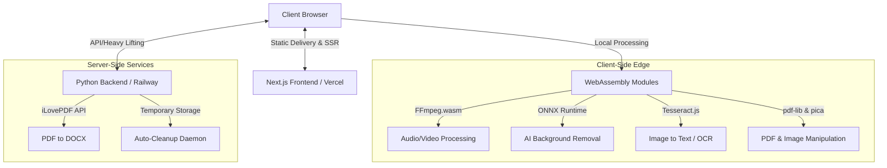

<div align="center">


# FileForge 🛠️

**The All-in-One File Toolkit for India & the World 🇮🇳🌍**

_Free · Open Source · No Sign-up · Privacy First_

[](https://forgetech.vercel.app)
[](https://github.com/mohd98zaid/FileForge)
[](LICENSE)

</div>

---

## 🌟 Introduction

**FileForge** is an advanced, modern, browser-based file utility platform offering **40+ intelligent tools** for handling images, PDFs, audio, video, and developer tasks. Built with a mobile-first approach, it caters to specific regional requirements (like Indian SSC, UPSC, Railway exam photo standards) and comprehensive global utility needs.

### 🎯 Core Philosophy

- **Zero Friction:** No sign-up required. Just open and use immediately.
- **Absolute Privacy:** Files are processed locally in your browser using _WebAssembly_ or deleted instantly on server-side tasks. They never linger.
- **True Accessibility:** Full bilingual support for English & Hindi (हिंदी), designed to function perfectly on every device screen.

---

## 🚀 Key Features Breakdown

### 📸 Pro-Level Image Manipulation

Harness the power of client-side image processing.

- **Exam / Visa Compliance:** specialized tools to automatically resize and watermark photos exactly to UPSC, SSC, NEET, and Visa specifications (35×45mm, 2×2 inch).
- **Format Conversion:** Seamlessly convert between `JPG`, `PNG`, `WebP`, and `HEIC`.
- **AI Background Removal:** Edge-computed ONNX models completely remove backgrounds without sending your photos to any server.
- **Smart Compression:** Reduce file sizes visually with real-time quality previews.
- **GIF Generation & Social Resizing:** Build animations or crop natively for Instagram, Twitter, and Facebook.

### 📄 Comprehensive PDF Suite

A full desktop-class PDF editor, running in your browser.

- **Merge & Split:** Combine multiple documents or extract exact pages.
- **Protection & Manipulation:** Encrypt, add watermarks, extract raw images, or reorder pages via drag-and-drop.
- **Conversions:** `PDF to Word (DOCX)`, `PDF to Images`, and `Images to PDF`.
- **eSign:** Draw, type, or upload digital signatures dynamically over PDFs.

### 🛠️ Developer & Utility Taskbox

Tools built for technical productivity.

- **Data Converters:** `JSON ↔ CSV` conversions, `Timestamp/Epoch` translations.
- **Code Utilities:** `SQL Formatter`, text `Diff Checker`, and real-time `Markdown Editor`.
- **Generators:** Custom `QR Code` generation with logos, `Password Generator`, and `Lorem Ipsum`.
- **Exchangers:** Real-time `Currency Converter` supporting 150+ currencies.

### 🎬 Media & OCR

- **Audio Extract:** Rip audio from any local video file directly in the browser.
- **Format Converter:** `MP3 ↔ WAV ↔ OGG` conversions built with WebAssembly FFmpeg.
- **Optical Character Recognition (OCR):** Extract text from images locally supporting 100+ languages.

---

## 🏛️ Architecture & Technical Perspective

FileForge leverages a modern, decoupled architecture designed for scale, speed, and privacy.

### System Flow



### 🧱 Tech Stack

| Layer                     | Technology                      | Purpose                                               |
| :------------------------ | :------------------------------ | :---------------------------------------------------- |
| **Framework**             | Next.js 16 (App Router)         | Core application routing, SSR, and API routes.        |
| **Language**              | TypeScript                      | Type safety and robust codebase maintenance.          |
| **Styling**               | Tailwind CSS                    | Rapid UI development with responsive utility classes. |
| **i18n**                  | `next-intl`                     | Seamless bilingual experience (English & Hindi).      |
| **State/Local**           | IndexedDB via LocalForage/Dexie | Offline data caching and state handling.              |
| **In-Browser Processing** | WebAssembly (FFmpeg, Tesseract) | Heavy lifting without server costs or privacy risks.  |

### Architectural Highlights

1. **Client-First Processing:**
   Most computationally expensive tasks (video conversions, OCR, AI background removals) run via **WebAssembly (`.wasm`)** in the browser. This drastically reduces server load and ensures perfect user privacy.
2. **Stateless Server Architecture:**
   When tasks mandate a server (e.g., specific PDF to Word conversions via backend), the backend operates statelessly. Uploads are processed, requested over streams, and purged instantly. No database stores user files.
3. **Optimized Edge Delivery:**
   Deployed entirely on Vercel's Edge network, the application relies heavily on modern chunking, dynamic imports for heavy libraries (like `fabric.js` and `ffmpeg`), and responsive `next/image` optimization.

---

## 🛠️ Getting Started

### Prerequisites

- Node.js 18+
- npm or yarn

### Installation

```bash
# Clone the repository
git clone https://github.com/mohd98zaid/FileForge.git
cd FileForge/FileForge_frontend

# Install all dependencies
npm install

# Environment setup
cp .env.example .env.local
```

### Development Server

```bash
# Start the dev server with hot reload
npm run dev

# Lint check before commit
npm run lint
```

Navigate to [http://localhost:3000](http://localhost:3000)

### Environment Variables

| Variable              | Description                                          |
| :-------------------- | :--------------------------------------------------- |
| `NEXT_PUBLIC_API_URL` | Backend API Endpoint (e.g., `http://localhost:8000`) |

---

## 📁 Repository Structure

```
FileForge_frontend/
├── public/                 # Static static resources & manifest
├── messages/               # Localization strings (en.json, hi.json)
├── src/
│   ├── app/                # Next.js 14 App Router layout
│   │   ├── [locale]/       # Internationalized routes per tool
│   │   └── api/            # Serverless API logic
│   ├── components/         # Shared, reusable React UI components
│   ├── lib/                # Configuration arrays (tools list, SEO definitions)
│   ├── utils/              # Functional pure extraction (image/audio logic)
│   └── middleware.ts       # Route handler for locale redirections
└── tailwind.config.js      # Global styling configuration
```

---

## 🛡️ Privacy & Security Commitments

FileForge treats user privacy as a feature, not a byproduct:

1. **Local Everything:** With WebAssembly, all your sensitive documents stay exactly where they belong—on your device.
2. **Ephemeral Backend:** Any remote calls for PDF to DOCX manipulation are kept entirely sandboxed. Ephemeral storage is wiped upon request termination.
3. **No Trackers:** Free of analytics trackers, tracking cookies, and retargeting ads.

---

## 🤝 Contributing

Open source thrives on community. From fixing translations to adding massive features, all PRs are welcome!

1. Fork the repo and create your branch (`git checkout -b feature/AddAwesomeTool`)
2. Commit your changes (`git commit -m 'feat: Add an awesome tool'`)
3. Push to the branch (`git push origin feature/AddAwesomeTool`)
4. Open a Pull Request!

---

## ⚖️ License

Released under the [MIT License](LICENSE).

<div align="center">
  Built with ❤️ by <a href="https://github.com/mohd98zaid">Mohd Zaid</a>.
  <br/><br/>
  <strong>⭐ Star this repo to show your support! ⭐</strong>
</div>
